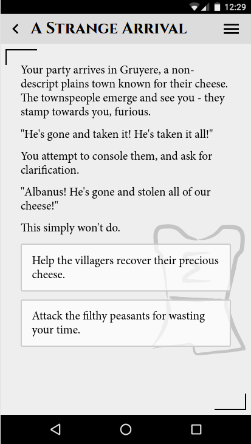

# Expedition Quest Editor - An Introduction

Welcome, fearless mortal, to the Expedition Quest Editor! Use this tool to craft custom quests of dangerous deeds and awful alliteration with speed and ease.

Quests are written in QDL, which is a variant of [Markdown](http://daringfireball.net/projects/markdown/). Here's a complete example quest: [Mistress Malaise](https://raw.githubusercontent.com/Fabricate-IO/expedition-quest-ide/master/docs/examples/mistress_malaise.md).

## In The Beginning: Quest Metadata

Every quest needs some metadata - the name of the quest, who wrote it, how long it takes to play, etc.

This information goes at the very beginning of your quest file. Here's an example:

```markdown
# Oust Albanus
summary: Your party encounters a smelly situation.
author: Scott Martin
email: scott@fabricate.io
url: expeditiongame.com
recommended-min-players: 2
recommended-max-players: 4
min-time-minutes: 20
max-time-minutes: 40
```

Once you've described what your quest is, it's time to dive into writing the quest itself.

## Worldbuilding: Roleplay Cards & Choices

Most exposition and world building takes place in `roleplay` cards, which occupy the full screen of the phone and slide to reveal more cards when the user makes a choice.

User `choice`s are displayed at the bottom of the `roleplay` card as rectangular buttons of text, and describe potential actions the user or party can take at that time.



*Fig 1: Roleplay card with choices*

In QDL, roleplay cards are written using `_underscores_` to denote a title and subsequent lines for text. Note that only lines of text separated by whitespace will be
separated by whitespace when loaded in the app (basically, hitting Enter once does nothing to the rendered quest). For example, the roleplay card above looks like this in QDL:

Choices are written in QDL by bullet points

```markdown
_A Strange Arrival_

Your party arrives in Gruyere, a non-descript plains town known for their cheese.
The townspeople emerge and see you - they stamp towards you, furious.

"He's gone and taken it! He's taken it all!"

You attempt to console them, and ask for clarification.

"Albanus! He's gone and stolen all of our cheese!"

This simply won't do.

*   Help the villagers recover their precious cheese.

    "Thank you!" they shout, weeping with joy. "That cheese is our livelihood here in Gruyere!"

*   Attack the filthy peasants for wasting your time.

    You begin to swing your weapons and cast magicks indescriminately into the crowd.

    _Card with a different title_

    Needless to say, the town guard is NOT pleased by your actions...
    ...

```

Note that there's card text directly after the `choice` bullet points - all data for cards that occur after players
tap a choice are on subsequent lines from the choice bullet point and indented appropriately. You can chain choices exactly as expected:

```markdown
*   Choice 1

    Roleplay card 1

    *    Choice 2

         Roleplay card 2

         *    Choice 3

              Roleplay card 3
```

Where Clicking `Choice 1` Displays "Roleplay card 1" and an option to click `Choice 2`, etc.

You may also notice that the `"Thank you!" ...` text didn't have an `_underscore_` title. Never fear - text immediately after a choice is put in its own roleplay card and inherits the title of
its immediate parent card (in this case, `_A Strange Arrival_`). This is useful if you have several independent choices to make within the same literary context and can't
be bothered to think up witty titles for every user decision.

## Adding Flair: JSON Annotations

To add some thematic flair to your roleplay cards, you can optionally specify a background watermark image (shown in Fig. 1 with an "adventurer" icon).

This takes the form of a [JSON](http://www.json.org/) annotation directly after the title of the roleplay card:

```markdown
_A Strange Arrival_ {"icon":"adventurer"}

Your party arrives in Gruyere...
```

In the case of roleplay card icons, you can replace `adventurer` with many other fields, including:

* adventurer
* bandit
* beast
* cards
* d20
* damage
* fae
* helper
* loot
* magic
* melee
* ranged
* undead

Keep an eye out for other such annotations in later parts of this tutorial - they're often used to specify things that QDL can't easily describe.

## Close Encounters: Combat Cards, Events, and Triggers

So what happens when we attack those peasants in our example quest? Let's add some combat into the mix!

```markdown
_combat_ {"enemies":["Archer","Veteran"],"icon":"bandit"}

*   on win

    You've destroyed the last of the guards... although come to think of it, why were they wearing masks?

*   on lose

    As you witness the last of your party fall, you can't help but wonder... why were the guards dressed as bandits?

    **end**
```


*Fig 2: Combat card*

Hopefully you're seeing a pattern here. Combat cards are exactly like roleplay cards, except their title is `_combat_`.

One or more enemies are added as the JSON array above - these names exactly match the names of the encounters in your deck, and
other data (like their Tier) is automatically looked up for you by the app.

The bulleted lines are, perhaps surprisingly, *not* `choice`s, although they have similar behavior; any bullet starting with "on", followed by a space,
followed by some word is called an `event`. Events are never displayed to users, but are instead used by the app when various events occur (such as winning a battle).

At the end of the lose event, there's a `**end**` tag. This is called a `trigger`, and indicates to the app that something unusual should happen.
In this case, we're signaling that this is the end of the quest, since the party's dead and gone. In this case, the trigger displays a singular "End" choice that
transports the user back to the quest menu.

Now, with encounters, there's an additional factor we have to consider: balance. We can't have our brand-new adventurers fight the Bandit Captain on their first fight! Not only would they not have enough loot and skill to defeat him, but it'd ruin the pacing of the quest (after all, what's there to fight above the leader?).

Here's what we recommend for a well-balanced quest: all possible first encounters have a sum tier of 2-3, the mid-quest fights slowly increase in difficulty from 4-6, and the final boss fight should be around 6-8.
That being said, these are just guidelines! You can absolutely mess with your players - upon first arriving at the town and hearing of the Bandit encampment, they could decide to charge straight in and fight the Captain and his minions. They'll lose, of course, but that doesn't mean they can't try!

## Orders from Above: Instruction Sections

Sometimes you need to tell your players stuff about the rules and mechanics of your quest, without writing it in character. To keep in-character and out-of-character
text separate, there are `instruction` tags:


*Fig 3: Instruction tag*

These are denoted by `>` prefixes in QDL, like so:

```markdown

> All players now have 6 HP

```

You can include these anywhere you have roleplaying text. Multiple single carats are pushed together into a single instructional "block":

```markdown

> Instructional text

> More instructional text that's grouped with the above

```

## Branching Out: Gotos and IDs

After six or so choice branches, you'll probably be sick and tired of indenting everything.
To reclaim that lost whitespace and allow for more complex story paths (including loops and recurrence)
we've introduced IDs and Gotos:

```markdown

_Card A_ {"id":"CardA"}

*   Some choice {"goto":"Combat"}

_combat_ {"enemies":[...],"id":"Combat"}

*   on win {"goto":"CardA"}

*   on lose {"goto":"CardA"}

```

While admittedly not super interesting as a quest, this example is pretty interesting from a story path perspective:

* Card A can be referred to elsewhere as `CardA`.
* Combat can be referred to elsewhere as `Combat`.
* When the player taps "Some choice", they're directed to `Combat`.
* When the player wins or loses combat, they're directed to `Card A`.
* Any number of locations can "goto" the same destination (in this case, combat win and lose events)
* IDs **must be unique across the entire quest**.

## Wrapping up

That's all there is to it! If you're stuck or need a reference, you can check out some examples of completed quests:

* [Oust Albanus](examples/oust_albanus.md)
* [Mistress Malaise](examples/mistress_malaise.md)
